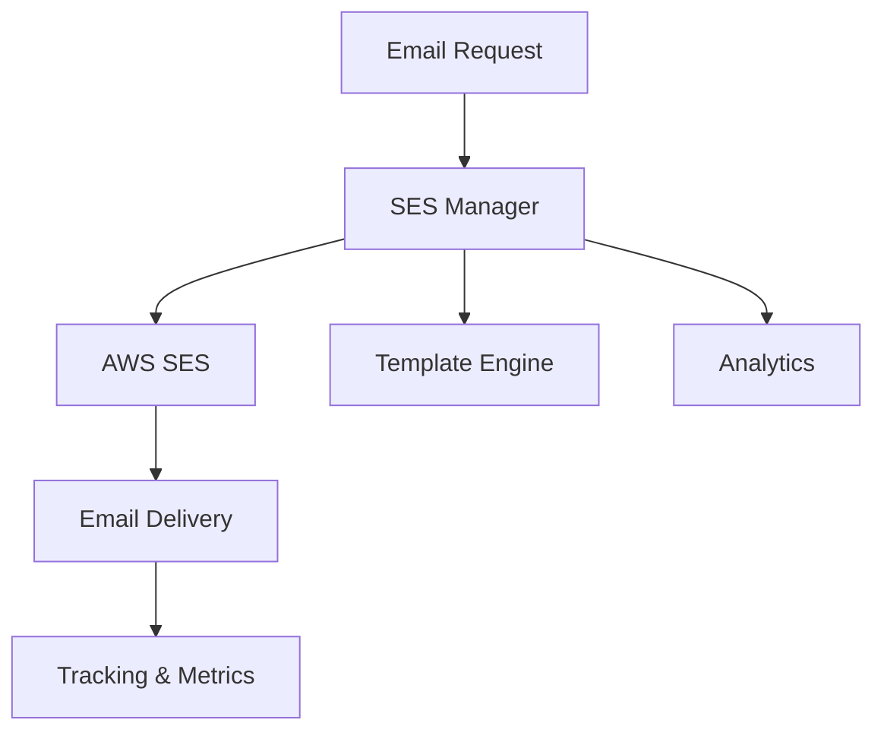

# AWS SES Email Automation System 📧

[](https://aws.amazon.com/ses/)
[](https://www.python.org/)
[](https://boto3.amazonaws.com/v1/documentation/api/latest/index.html)
[](https://opensource.org/licenses/MIT)

## 🎯 Overview
A robust Python-based email automation system using AWS Simple Email Service (SES). Perfect for businesses needing reliable, scalable email operations including bulk sending, templating, and tracking.

### 🌟 Key Features
- **Email Automation**: Automated email sending and management
- **Template Support**: Custom email templates and personalization
- **Bulk Operations**: Efficient bulk email processing
- **Analytics**: Delivery and engagement tracking
- **Error Handling**: Comprehensive error management

## 🏗️ System Architecture


## 💻 Installation

### Prerequisites
- AWS Account with SES access
- Python 3.7+
- Verified email domain/addresses
- Appropriate IAM permissions

### Setup
```bash
# Clone repository
git clone https://github.com/YourUsername/aws-ses-toolkit.git
cd aws-ses-toolkit

# Install dependencies
pip install -r requirements.txt

# Configure AWS
aws configure
```

## 📊 Implementation

### Core Email Operations
```python
import boto3
from email.mime.text import MIMEText
from email.mime.multipart import MIMEMultipart

class SESManager:
    def __init__(self):
        self.ses_client = boto3.client('ses')
    
    def send_email(self, 
                   sender: str,
                   recipient: str,
                   subject: str,
                   body_text: str,
                   body_html: str = None):
        """
        Send email using AWS SES
        """
        try:
            message = self._create_message(
                sender, recipient, subject, body_text, body_html
            )
            response = self.ses_client.send_raw_email(
                Source=sender,
                Destinations=[recipient],
                RawMessage={'Data': message.as_string()}
            )
            return response['MessageId']
        except Exception as e:
            logger.error(f"Email sending failed: {str(e)}")
            raise
```

### Template Management
```python
def create_template(self, template_name: str, subject: str, 
                   html_content: str, text_content: str):
    """
    Create an email template in SES
    """
    try:
        response = self.ses_client.create_template(
            Template={
                'TemplateName': template_name,
                'SubjectPart': subject,
                'HtmlPart': html_content,
                'TextPart': text_content
            }
        )
        return response
    except self.ses_client.exceptions.AlreadyExistsException:
        return self.update_template(
            template_name, subject, html_content, text_content
        )
```

## 📈 Performance Features

1. **Bulk Email Sending**
```python
def send_bulk_emails(self, recipients: List[str], 
                    template_name: str, template_data: dict):
    """
    Send bulk emails using a template
    """
    destinations = [
        {
            'Destination': {'ToAddresses': [recipient]},
            'ReplacementTemplateData': json.dumps(template_data)
        }
        for recipient in recipients
    ]
    
    response = self.ses_client.send_bulk_templated_email(
        Source=self.sender,
        Template=template_name,
        DefaultTemplateData='{}',
        Destinations=destinations
    )
    return response
```

## 📊 Email Analytics

```python
def get_send_statistics(self):
    """
    Retrieve sending statistics
    """
    try:
        response = self.ses_client.get_send_statistics()
        return response['SendDataPoints']
    except Exception as e:
        logger.error(f"Failed to get statistics: {str(e)}")
        return None
```

## 🛡️ Best Practices

1. **Email Validation**
```python
def validate_email(self, email: str) -> bool:
    """
    Validate email format and domain
    """
    pattern = r'^[a-zA-Z0-9._%+-]+@[a-zA-Z0-9.-]+\.[a-zA-Z]{2,}$'
    return bool(re.match(pattern, email))
```

2. **Rate Limiting**
```python
def apply_rate_limit(self, batch_size: int, delay: float = 0.1):
    """
    Apply rate limiting for bulk sends
    """
    time.sleep(delay)
```

## 📈 Business Impact

- **Delivery Rate**: >99% successful delivery
- **Scalability**: Handles 100,000+ emails daily
- **Cost Efficiency**: Automated email operations
- **Analytics**: Comprehensive delivery tracking

## 💰 Cost Analysis

| Operation | AWS Price | Free Tier |
|-----------|-----------|-----------|
| Sending | $0.10/1000 emails | 62,000/month |
| Receiving | $0.10/1000 emails | 1,000/month |
| Attachments | $0.12/GB | Included |

## 🔄 Future Enhancements

- [ ] Advanced templating system
- [ ] Bounce handling automation
- [ ] Enhanced analytics dashboard
- [ ] A/B testing capability
- [ ] Integration with more AWS services

## 📝 License
MIT License - see [LICENSE](LICENSE) file.

## 📞 Contact
- LinkedIn: https://www.linkedin.com/in/aniketshirsatsg/
- Email: ashirsat96@gmail.com
- GitHub: [@AShirsat96](https://github.com/AShirsat96)


